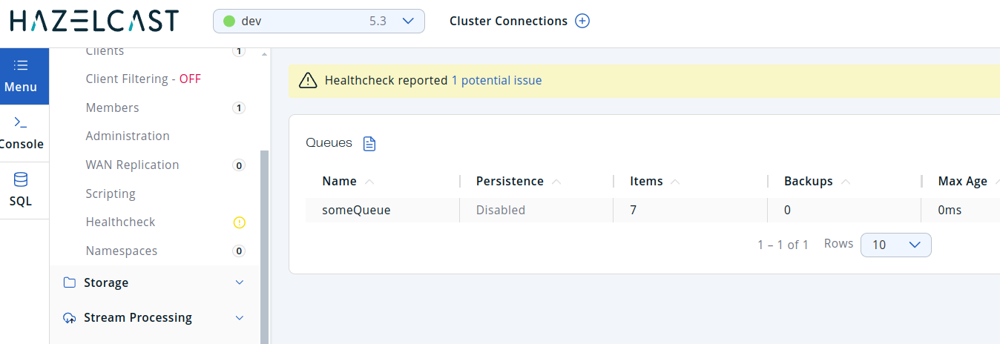

# Envoy golang plugin with hazelcast

Test queuing events in Hazelcast from an Envoy golang plugin.

## Build Local

    make local.build

## Run Local

1) Run envoy, this requires the contrib version so not sure if func-e can be used, running in docker:

        docker run -it --rm --net host -p 9901:9901 -p 8080:8080 -v $(pwd)/lib/libloghz.so:/lib/libloghz.so -v $(pwd)/config/envoy.yaml:/etc/envoy/envoy.yaml envoyproxy/envoy:contrib-v1.31-latest

2) Run hazelcast local to envoy also (didn't bother having a hazelcast config in the client connection)

3) The target is webhook.site, get a GUID from there first.

4) Envoy is listening on port 8080, call that with the webhook.site GUID, e.g.

        curl http://localhost:8080/03e9d944-0431-4027-b969-7022fc34e576

5) On every request the path is logged to the "someQueue" queue.

    ```
    func (f *filter) DecodeHeaders(header api.RequestHeaderMap, endStream bool) api.StatusType {
        queue, err := f.config.hazelcastClient.GetQueue(context.Background(), "someQueue")
        if err != nil {
            return f.sendLocalReplyInternal(err.Error(), 500)
        }

        // Add something to the queue
        queue.Add(context.Background(), f.path)
    ```

6) Run management center to view the events:

        docker run --rm -p 18080:8080 hazelcast/management-center:5.5

    Connect to localhost:5701

